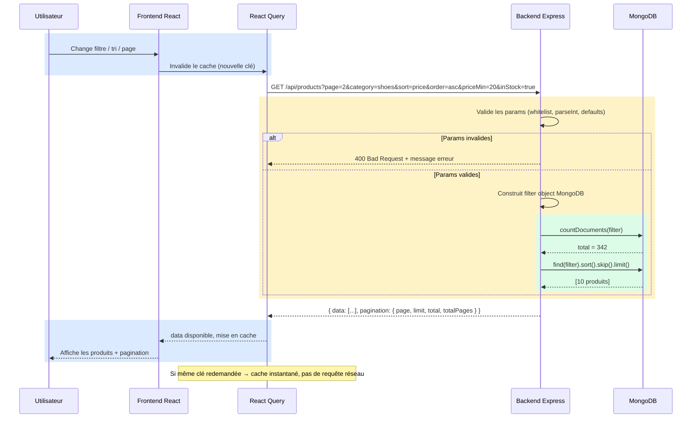

# Cahier des charges — Test technique

## 1. Contexte

L’entreprise est une **plateforme e‑commerce** (mode, accessoires, etc.) avec un **gros catalogue**. Aujourd’hui, le site charge **tout le catalogue d’un coup** : temps de chargement élevé, charge inutile côté navigateur et risque de mauvaise expérience utilisateur.

**Objectif du test :** concevoir une solution **paginée côté serveur**, avec **filtres** et **tris**, une gestion des erreurs, et une stack imposée.

---

## 2. Problème à résoudre


| Axes                        | Description                                                                                                       |
| --------------------------- | ----------------------------------------------------------------------------------------------------------------- |
| **Performance**             | Ne plus renvoyer ni afficher l’intégralité des articles en une seule requête / un seul rendu.                     |
| **Fonctionnalité**          | Permettre la navigation dans le catalogue (pagination **ou** scroll infini **ou** équivalent — libre choix d’UX). |
| **Recherche / exploration** | **Filtrer** (ex. par catégorie) et **trier** (ex. prix croissant / décroissant).                                  |
| **Fiabilité**               | Pas de crash en cas de paramètres invalides, réseau instable ou réponse vide.                                     |


---

## 3. Périmètre fonctionnel


| Exigence       | Détail                                                                                                                                                   |
| -------------- | -------------------------------------------------------------------------------------------------------------------------------------------------------- |
| **Pagination** | Stratégie au choix (pages numérotées, « charger plus », scroll infini…) **à condition** que les données soient chargées **par blocs** depuis le backend. |
| **Filtres**    | Au minimum un filtre pertinent sur le catalogue (ex. catégorie) ; possibilité d’en ajouter d’autres si le temps le permet.                               |
| **Tris**       | Au minimum un tri sur un champ numérique ou textuel (ex. **prix** asc / desc).                                                                           |


---

## 4. Contraintes techniques (obligatoires)


| Couche              | Technologie                             |
| ------------------- | --------------------------------------- |
| **Frontend**        | **React** (JavaScript ou TypeScript)    |
| **Backend**         | **Node.js** avec **Express** (JS ou TS) |
| **Base de données** | **MongoDB** — **sans Mongoose**         |


Le reste (outillage, structure des dossiers, librairies UI) est laissé au candidat, dans la mesure où les exigences ci-dessus sont respectées.

---

## 5. Livrables attendus

- API REST (ou équivalent **documenté**) exposant une **liste d’articles paginée**, avec paramètres documentés : `page`, `limit`, filtres, etc..
- Frontend connecté à cette API, avec l’UX de pagination / chargement choisie.
- Gestion des cas limites : valeurs de pagination invalides, liste vide, erreur serveur, etc...

---

## 6. Hors périmètre / libertés

- **Design graphique :** libre (sobriété suffisante pour un test).
- **Modalité d’interaction** (boutons vs scroll infini, etc.) : libre, tant que le chargement reste **incrémental côté serveur**.


# Catalogue Produits — Documentation technique

## Stack

| Couche | Technologie |
|--------|-------------|
| Frontend | React 18 + Vite |
| État serveur | TanStack Query (React Query) |
| Backend | Node.js + Express |
| Base de données | MongoDB 7 (driver natif, sans Mongoose) |
| Infra | Docker Compose |

---

## Architecture



---

## API

### `GET /api/products`

Retourne une liste paginée de produits avec filtres et tris.

#### Paramètres

| Paramètre | Type | Défaut | Description |
|-----------|------|--------|-------------|
| `page` | `integer` | `1` | Numéro de page (min: 1) |
| `limit` | `integer` | `10` | Produits par page (min: 1, max: 100) |
| `category` | `string` | — | Filtre par catégorie (`shoes`, `clothing`, `accessories`, `bags`) |
| `priceMin` | `number` | — | Prix minimum (inclusif) |
| `priceMax` | `number` | — | Prix maximum (inclusif) |
| `inStock` | `boolean` | — | Si `true`, retourne uniquement les produits avec stock > 0 |
| `sort` | `string` | `createdAt` | Champ de tri (`price`, `stock`, `createdAt`, `name`) |
| `order` | `string` | `desc` | Ordre de tri (`asc`, `desc`) |

#### Réponse

```json
{
  "data": [
    {
      "_id": "...",
      "name": "Urban Drift — Essential Henley (Minimal)",
      "description": "...",
      "price": 26.99,
      "category": "clothing",
      "stock": 7,
      "createdAt": "2026-05-25T17:57:15.824Z"
    }
  ],
  "pagination": {
    "page": 1,
    "limit": 10,
    "total": 342,
    "totalPages": 35
  }
}
```

#### Erreurs

| Code | Cas |
|------|-----|
| `400` | Paramètre invalide (page < 1, catégorie inconnue, sort non autorisé…) |
| `500` | Erreur interne serveur |

---

## Justifications techniques

### Pages numérotées

La pagination numérotée est la stratégie la plus adaptée à un catalogue e-commerce avec filtres et tris. Elle permet à l'utilisateur de se repérer précisément dans le catalogue, de revenir en arrière et de naviguer librement. Le scroll infini et le "Load More" ont été écartés car ils accumulent tous les produits en mémoire côté client et rendent difficile le reset lors d'un changement de filtre ou de tri.

La pagination repose sur les opérateurs `skip` et `limit` de MongoDB. Sur 5 000 documents avec des index sur `category`, `price` et `createdAt`, les performances sont largement suffisantes. La pagination par curseur aurait constitué une sur-ingénierie injustifiée ici.

### React Query

Le `useEffect` natif a été écarté au profit de React Query pour trois raisons :

- **Race conditions** — React Query annule automatiquement les requêtes obsolètes, évitant qu'une réponse tardive écrase une réponse plus récente.
- **Cache automatique** — naviguer page 3 → page 4 → page 3 ne refait pas de requête réseau. L'option `keepPreviousData` évite le flash blanc entre les changements de page.
- **États natifs** — `isLoading`, `isError`, `isFetching` disponibles sans code répétitif.

### Validation manuelle

Avec 8 paramètres simples à valider, une validation manuelle avec `parseInt`, valeurs par défaut et whitelist couvre tous les cas en une vingtaine de lignes. Des librairies comme Zod auraient permis de remplacer les ~50 lignes de validation manuelle par un schéma déclaratif de 10 lignes, mais constituent une dépendance injustifiée pour 8 paramètres simples. Sur un projet en production avec des dizaines de paramètres, leur utilisation serait justifiée.

### Filtres

- **Catégorie** — filtre exact sur `category`.
- **Prix min/max** — plage sur `price` via `$gte` / `$lte`, optionnels et combinables.
- **En stock** — filtre booléen `stock > 0` via `$gt`. Pertinent pour l'UX e-commerce.

Le filtre par marque a été écarté : le champ `brand` n'existe pas en base, la marque étant intégrée dans `name`. Un filtre regex aurait été approximatif et peu performant sans index texte.

### Tris

- **Prix** — tri sur `price`, le plus naturel pour un catalogue e-commerce.
- **Nouveauté** — tri sur `createdAt`, descendant par défaut, pour mettre en avant les derniers arrivages.

---

## Prérequis

### Sur Fedora / RHEL uniquement — SELinux
SELinux en mode `Enforcing` bloque les volumes Docker par défaut sur ces distributions.
Avant de lancer le projet, désactivez-le temporairement pour la session en cours :

```bash
sudo setenforce 0
```

Cette commande n'est pas persistante — au prochain reboot, SELinux reprend son mode normal automatiquement.

---

## Lancer le projet

```bash
# Démarrer les services
docker-compose up --build

# Seeder la base si nécessaire
# Le seed s'exécute automatiquement au premier lancement.
# Relancez cette commande uniquement si la base est vide (ex: après un docker-compose down -v)
docker exec -it test_mongo mongosh /docker-entrypoint-initdb.d/seed.js
```

| Service | URL |
|---------|-----|
| Frontend | http://localhost:5173 |
| Backend | http://localhost:3001 |
| MongoDB | mongodb://localhost:27018 |
